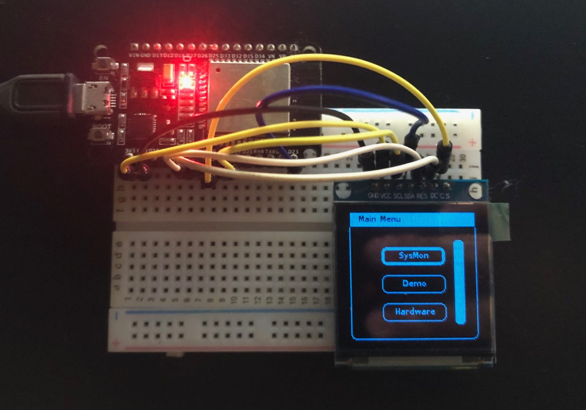

# LittlevGL project for ESP32

## Get started 
### Install the ESP32 SDK
1. Install ESP-IDF: http://esp-idf.readthedocs.io/en/latest/
2. Get this projects: `git clone https://github.com/Calebe94/ESP32-SSD1351.git --recurse-submodules

### Add LittlevGL to the build
To link LittlevGL (lvgl) and lv_examples with ESP-IDF you need to add a **component.mk** file to each directory. Next to this REAMDE file you find two example component.mk files
- lvgl_component.mk
- lv_example_component.mk
Rename them to component.mk and copy to the lvgl and lv_examples directories.

### Flash to ESP32
1. Go to the project's diectory
2. `make`
3. `make flash`
